# Phantom
**파노라마팬텀을 이용한 파노라마방사선장비평가소프트웨어**
=======  


해당 소프트웨어는 서울대학교 공대-치대 학제간 융합 연구를 통해 이루어 졌습니다.  


>>- 공과대학 컴퓨터공학부 분산시스템 연구실   **염헌영 교수님**
>>- 치의학대학원 영상치의학교실              **이삼선 교수님**  


**볼 팬텀**은 파노라마방사선장비의 상층 형태와 크기를 평가하기 위해 제작되었습니다.  
Phantom소프트웨어는 볼 팬텀으로 획득한 영상을 정확하고 편리하게 평가하기 위한 프로그램입니다. 

Phantom소프트웨어에서 구현된 기능과 그 사용법에 관련된 설명은 다음과 같습니다.  

- [분석영상선택하기](#첫화면home)  
- [분석결과](#결과Result)
    - [매칭정보확인](#매칭정보)
    - [분석결과 모아서보기](#종합분석결과)
- [영역분석](#Image_Layer)
- [해상도분석](#MTF)
- [영상촬영방향분석](#Central_Ray)
- [영상촬영속도분석](#Image_gain_velocity)
- [기타](#기타유의사항)

-------
1. ## 첫화면(home)
-------

  

**파노라마방사선장비평가 소프트웨어의 첫화면입니다.**  
```
    소프트웨어가 제공하는 기능에 관한 간단한 설명과 함께, 분석하려는 영상을 선택할 수 있습니다.  
```

**1-1. 단일 분석 영상의 선택**  
  
영상이 선택된 후 **분석할 영역을 선택**하여야 합니다.  
```
    영상분석 후 악골도면과의 매칭작업을 위해 분석영역 지정이 필요합니다.  
    영역지정이 제대로 되지 않은 경우에, 분석 결과에 오차가 발생할 수 있습니다.  
```

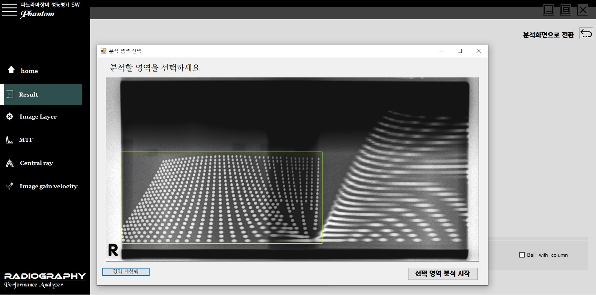
  


분석영역을 선택한 후에 **선택 영역 분석 시작**버튼을 누르면 분석을 시작합니다.  
```
    분석 영역을 잘못 지정한 경우에 [영역 재선택] 버튼을 통해, 영역 재지정을 할 수 있습니다.  
    분석 영역 지정이 필요하지 않은 사진의 경우, 영역지정 없이 분석을 시작할 수 있습니다.  
```

**1-2. Multi Slice 영상의 선택**  
멀티 슬라이스 분석은 서로 다른 초점 영역(focal layer)을 갖는 연속적인 분석영상들이 담긴 폴더를 한 번에 분석해주는 기능입니다.  
```
   2019년 5월 현재, 분석영역 지정과 관련된 오류 수정 중 입니다.
```

-------
2. ## 결과(Result)  
-------
  - ### 매칭정보  
  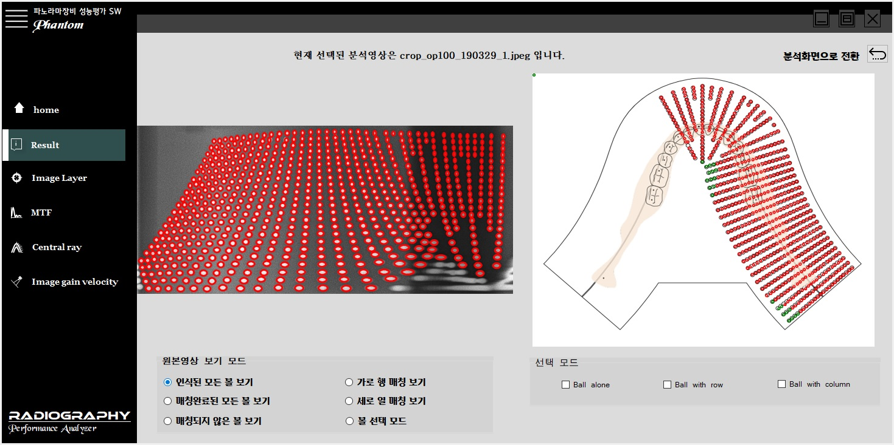  
  분석이 완료되면, 전체적인 분석결과를 종합해서 보여줍니다. 하지만 그 전에 분석영상과 도면 간의 잘못된 매칭영역이 있는 지를 우선 표현합니다. **원본영상 보기 모드**의 선택을 통해 다양한 방식의 매칭정보를 확인할 수 있습니다.  
  ```
      - 인식된 모든 볼 보기  : 매칭이 완료된 볼과 그렇지 않은 볼을 함께 보여줍니다.
      - 가로 행 매칭 보기 : 매칭의 결과, 같은 행으로 매칭된 볼들을 보여줍니다.
      - 세로 열 매칭 보기 : 매칭의 결과, 같은 열로서 매칭된 볼들을 보여줍니다.  
      - 볼 선택 모드 : 사용자가 직접 선택하여서, 분석영상과 도면과의 매칭 정보를 볼/가로 행/세로 열에 대해 확인합니다. 
  ```
    
  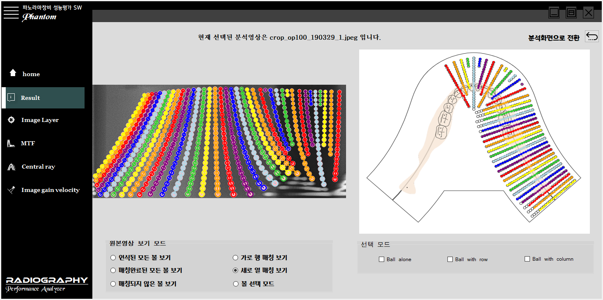  
    
   **세로 열 매칭 보기**모드  
  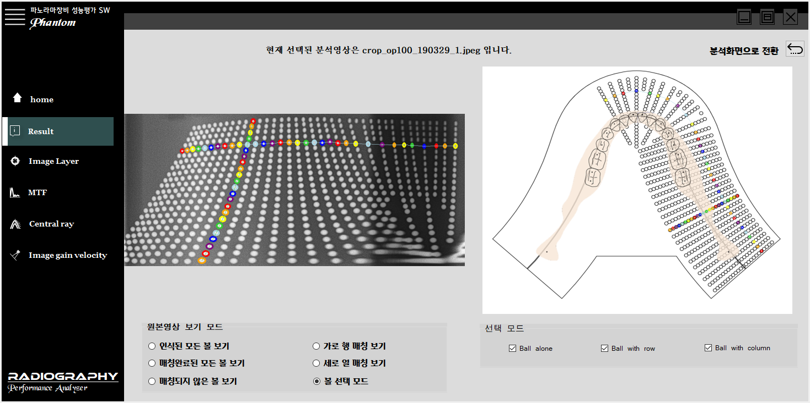  
    
  **볼 선택 모드**  
  원본 분석 영상을 직접 클릭하여, 매칭정보를 확인하고 싶은 볼을 선택할 수 있습니다.  
    
    
    오른쪽 상단의 [분석화면으로 전환]버튼이나 왼쪽의 다른 분석 메뉴를 선택하면, 매칭정보 화면이 닫힙니다.  
    이후에 [볼 매칭 확인]버튼을 통해 언제든 매칭정보를 다시 확인할 수 있습니다.  
      
  - ### 종합분석결과  
  
  Phantom 소프트웨어가 제공하는 분석결과를 한 화면에 동시에 보여줍니다.  
  주요 분석기능은 **( Image Layer / Central Ray / MTF 분석 )** 입니다.  
  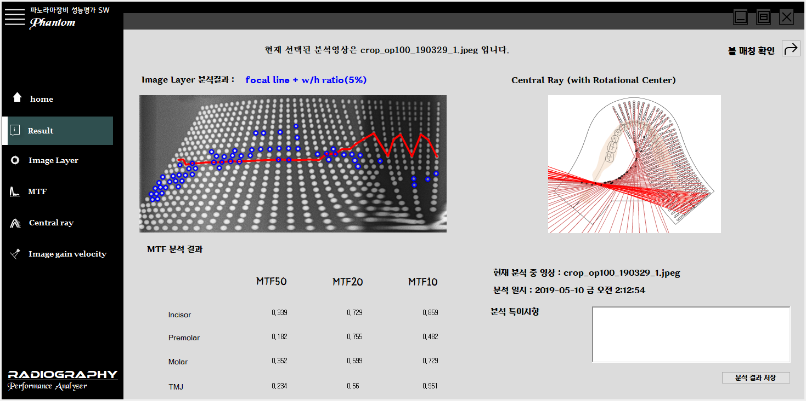  
    분석 후 발견된 특이사항을 기록한 후에 **분석 결과 저장** 버튼을 누르면, 종합결과분석 창이 사진으로 저장됩니다.    
    저장과 관련된 사항은 [저장](#저장)에서 확인할 수 있습니다.  
    
-------
3. ## Image_Layer
-------
촬영된 영상의 상층 영역의 크기와 형태에 관한 분석을 제공하는 기능입니다.  
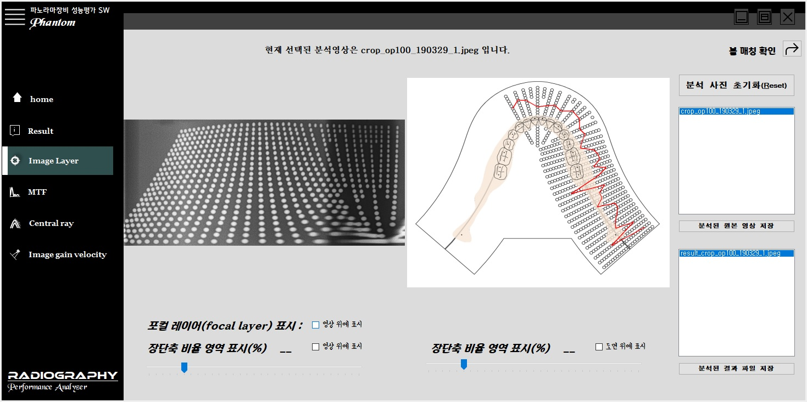  

촬영영상의 초점 영역인 **포컬 레이어(focal layer)** 를 나타내는 볼 들은 경계영역에서 높은 해상도를 갖는 선명한 볼을 의미합니다. 
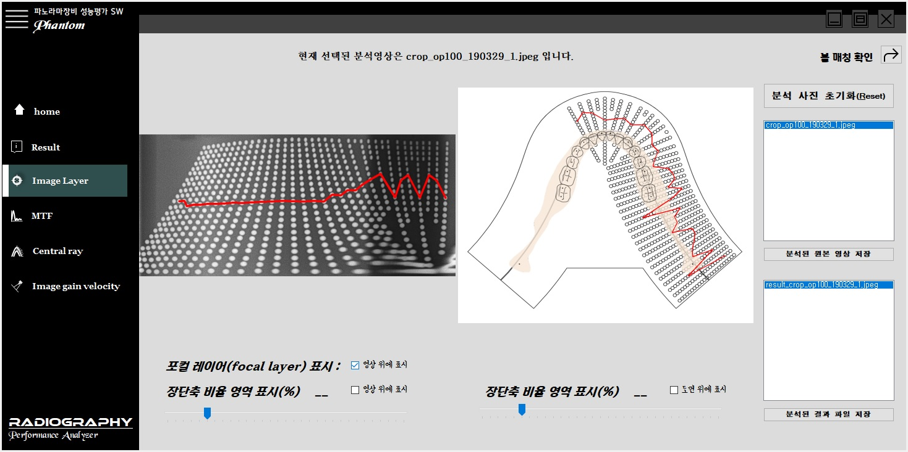  
**포컬 레이어(focal layer) 표시** 를 클릭한 경우, 원본 영상에서도 포컬 레이어의 위치를 표시할 수 있습니다.  
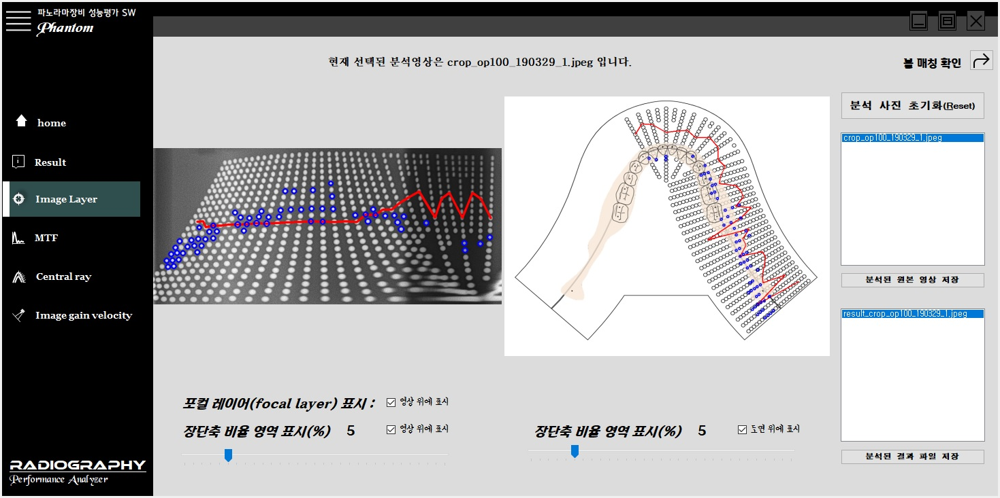  
한편, **장단축 비율 영역 표시** 를 클릭한 경우, 기존 프로그램에서 포컬 레이어를 구하기 위해서 사용되었던 **볼의 장단축 비율**에 따른 볼의 분포를 나타냅니다.  
```
비율은 완전한 원에서 벗어난 정도를 의미하고, 비율이 클수록 타원에 가까워집니다.  
```  
마지막으로 오른쪽의 **분석된 원본 영상 저장**과 **분석된 결과 파일 저장**을 통해 포컬 레이어와 비율 영역이 표시된 원본 영상과 도면 결과 영상을 저장합니다.  
저장과 관련된 사항은 [저장](#저장)에서 확인할 수 있습니다.  


-------
4. ## MTF
-------
촬영된 영상의 해상도 정보를 제공하는 기능입니다. 팬텀의 주요 부분에 위치한 4개의 볼과 사용자가 직접 선택한 볼에 대해서 해상도를 나타내는 MTF를 구합니다.  
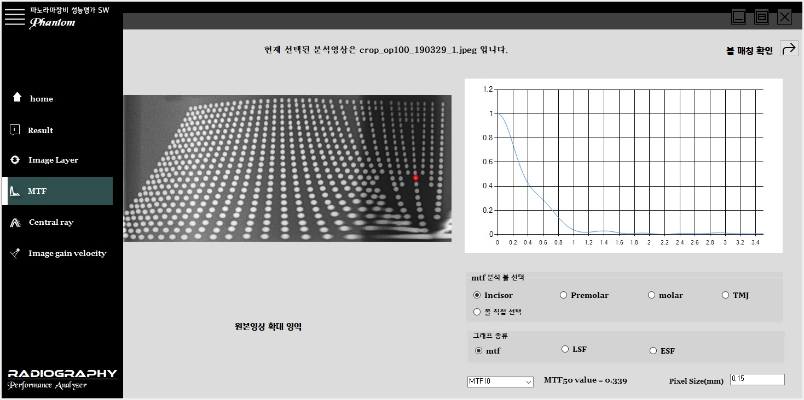
```
   MTF 값을 계산하는데 중요한 요인인 픽셀 크기(pxel size)를 영상 설정에 맞게 수정할 수 있습니다.  
   MTF 수치 중에서 중요도가 높은 Mtf50, Mtf20, Mtf10 값은 선택하여 확인할 수 있습니다.  
```
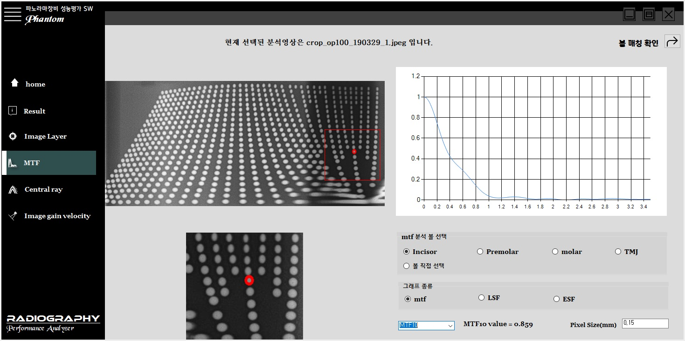  
MTF그래프 이외에도, ESF(Edeg spread function) 및 LSF(Line spread function) 그래프를 선택할 수 있습니다.  
```
   MTF가 계산되고 있는 볼 영역을 확대해 볼 수 있습니다.   
   원본 영상 위의 확대 영역을 설정하면, 원본영상 확대영역에서 확대된 영상을 확인할 수 있습니다.
```

-------
5. ## Central_Ray
-------
촬영 영상의 가장 윗쪽 볼들에서 수직선을 내려 긋는 방식으로, 볼 팬텀의 각 위치에서의 x-ray 방향을 파악할 수 있습니다.  
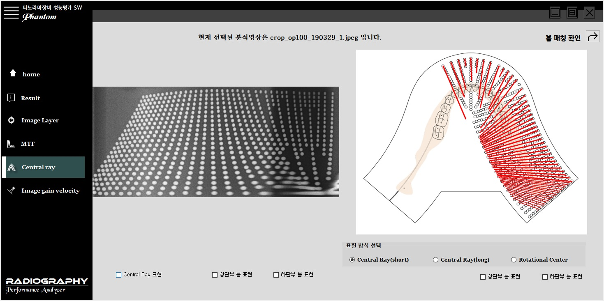  

분석영상의 촬영방향을 이해하는 데 도움을 줄 수 있는, 다양한 표현방식을 제공합니다.  
```
   Central Ray(short) : x-ray 수직선을 악골도면의 맨 윗 열에서 가장 아랫 열까지 그려줍니다.  
   Central Ray(long)  : x-ray 수직선을 악골도면의 맨 윗 열로부터 다른 수직선과 만나도록 연장하여 그려줍니다.  
   Rotational Center  : 이웃한 central ray 수직선들의 교점을 통해, rotational center를 구해줍니다.  
   상단부 볼 표현  : 인식된 볼들 중에서 central ray 수직선의 출발점이 될 수 있는 맨 윗 열 볼들을 그려줍니다.  
   하단부 볼 표현  : central ray 수직선이 지나가는 가장 아랫 열의 볼들을 그려줍니다.
```

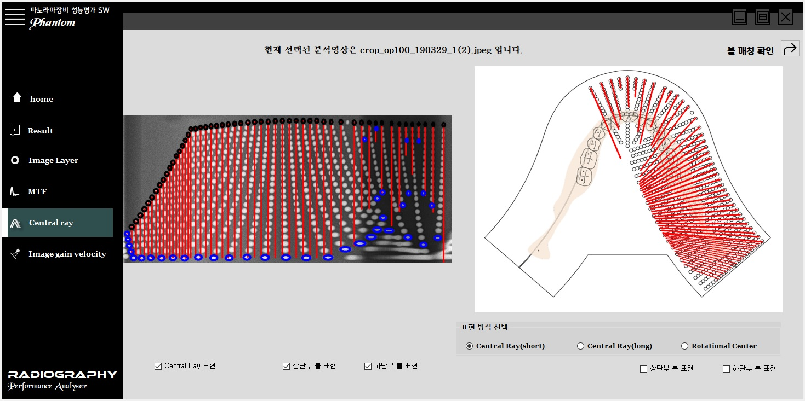  
원본 영상에도 central ray, 상단부 볼 표현, 하단부 볼 표현 기능을 제공합니다.  

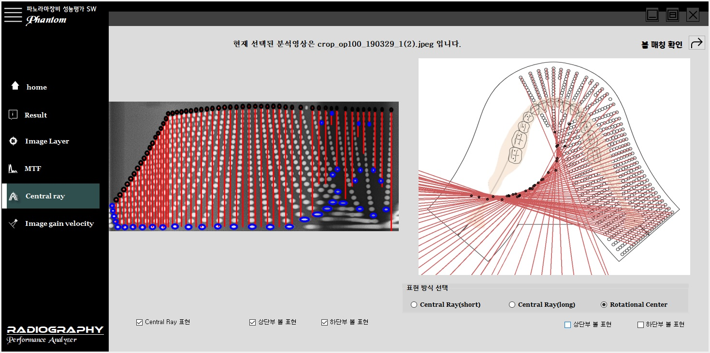  
  
-------
5. ## Image_gain_velocity  
-------

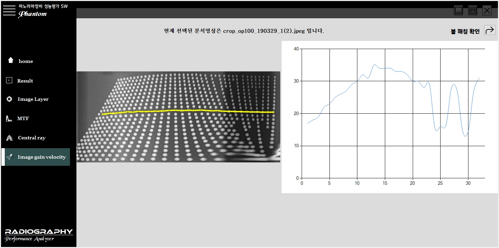  
촬영 영상 가운데 열의 볼 간 간격은 볼 팬텀이 촬영되는 속도를 유추할 수 있는 정보를 제공합니다. 
볼 간격은 일관된 해석을 위해서 인접한 볼 사이의 픽셀 수를 의미합니다.  

-------
기타유의사항
-------
## 저장  
    Phantom 소프트웨어의 분석기능을 사용하면서, 해당 기능의 분석결과를 저장할 수 있습니다.  
    저장결과는 바탕화면에 해당날짜 명의 폴더 안에 저장됩니다.  
