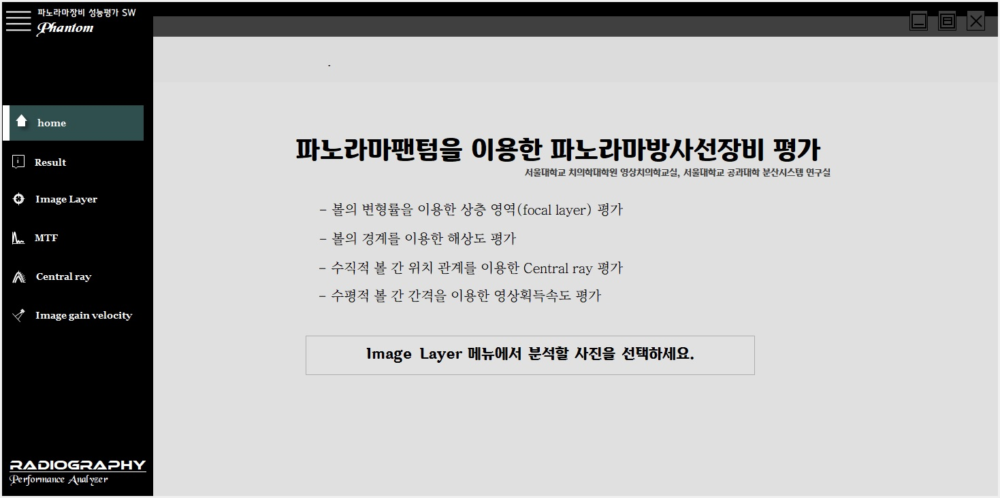

# Phantom
**파노라마팬텀을 이용한 파노라마방사선장비 평가 소프트웨어**

해당 소프트웨어는 서울대학교 공대-치대 학제간 융합 연구를 통해 이루어 졌습니다.

>>- 공과대학 컴퓨터공학부 분산시스템 연구실   **염헌영 교수님**
>>- 치의학대학원 영상치의학교실              **이삼선 교수님**

**볼 팬텀**은 파노라마방사선장비의 상층 형태와 크기를 평가하기 위해 제작되었습니다.  
Phantom소프트웨어는 볼 팬텀으로 획득한 영상을 정확하고 편리하게 평가하기 위한 프로그램입니다. 

Phantom소프트웨어에서 구현된 기능과 그 사용법에 관련된 설명은 다음과 같습니다.  

- [분석영상선택하기](#첫화면home)  

1. ##분석영상선택하기  

